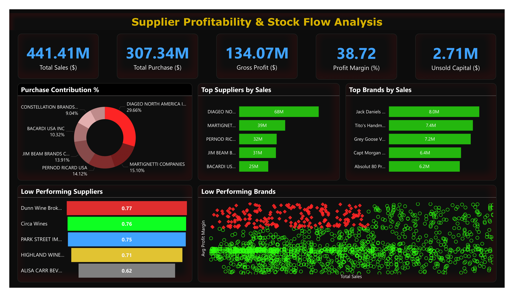

# 🧾 Supplier Profitability & Stock Flow Analysis – Retail Inventory & Sales

_Analyzing supplier efficiency and profitability to support strategic purchasing and inventory decisions using SQL, Python, and Power BI._

---

## 📌 Table of Contents
- [Overview](#overview)
- [Business Problem](#business-problem)
- [Dataset](#dataset)
- [Tools & Technologies](#tools--technologies)
- [Data Cleaning & Preparation](#data-cleaning--preparation)
- [Exploratory Data Analysis (EDA)](#exploratory-data-analysis-eda)
- [Research Questions & Key Findings](#research-questions--key-findings)
- [Dashboard](#dashboard)
- [Final Recommendations](#final-recommendations)
- [Author & Contact](#author--contact)

---

## Overview

This project evaluates supplier performance and retail inventory dynamics to drive strategic insights for purchasing, pricing, and inventory optimization.  
A complete data pipeline was built using **SQL** for ETL, **Python** for analysis and hypothesis testing, and **Power BI** for visualization.

---

## Business Problem

Effective inventory and sales management are critical in the retail sector.  
This project aims to:

- Identify underperforming brands needing pricing or promotional adjustments  
- Determine supplier contributions to sales and profits  
- Analyze the cost-benefit of bulk purchasing  
- Investigate inventory turnover inefficiencies  
- Statistically validate differences in supplier profitability  

---

## Dataset

- Multiple CSV files located in `/data/` folder (sales, suppliers, inventory)  
- Summary table created from ingested data and used for analysis  

---

## Tools & Technologies

- **SQL** (Common Table Expressions, Joins, Filtering)  
- **Python** (Pandas, Matplotlib, Seaborn, SciPy)  
- **Power BI** (Interactive Visualizations)  
- **GitHub**  

---

## Data Cleaning & Preparation

- Removed transactions with:  
  - Gross Profit ≤ 0  
  - Profit Margin ≤ 0  
  - Sales Quantity = 0  
- Created summary tables with supplier-level metrics  
- Converted data types, handled outliers, merged lookup tables  

---

## Exploratory Data Analysis (EDA)

**Negative or Zero Values Detected:**  
- Gross Profit: Min -52,002.78 (loss-making sales)  
- Profit Margin: Min -∞ (sales at zero or below cost)  
- Unsold Inventory: Indicating slow-moving stock  

**Outliers Identified:**  
- High Freight Costs (up to 257K)  
- Large Purchase/Actual Prices  

**Correlation Analysis:**  
- Weak between Purchase Price & Profit  
- Strong between Purchase Qty & Sales Qty (0.999)  
- Negative between Profit Margin & Sales Price (-0.179)  

---

## Research Questions & Key Findings

1. **Brands for Promotions** → 198 brands with low sales but high profit margins  
2. **Top Suppliers** → Top 10 suppliers = 65.69% of purchases → risk of over-reliance  
3. **Bulk Purchasing Impact** → 72% cost savings per unit in large orders  
4. **Inventory Turnover** → $2.71M worth of unsold inventory  
5. **Supplier Profitability**:  
   - High Suppliers: Mean Margin = 31.17%  
   - Low Suppliers: Mean Margin = 41.55%  
6. **Hypothesis Testing** → Statistically significant difference in profit margins → distinct supplier strategies  

---

## Dashboard

  

🔗 [View Live Dashboard](https://app.powerbi.com/view?r=eyJrIjoiZDk4NmQ5MmUtYzI5YS00OWE2LThjZjYtN2JiZWVlNmE2OGZmIiwidCI6ImJiNDY2NWQ2LTg4NzItNGIyMy1hY2U3LWFlZjE4YjcxYjBiZiJ9)  

---

## Final Recommendations

- Diversify supplier base to reduce risk  
- Optimize bulk order strategies  
- Reprice slow-moving, high-margin brands  
- Clear unsold inventory strategically  
- Improve marketing for underperforming suppliers  

---

## Author & Contact

**Siddhi Vijay Farakate**  
_Data Analyst_  

📧 Email: s.faraakate@gmail.com  
🔗 [LinkedIn](https://www.linkedin.com/in/sidd-pharakate/)  
